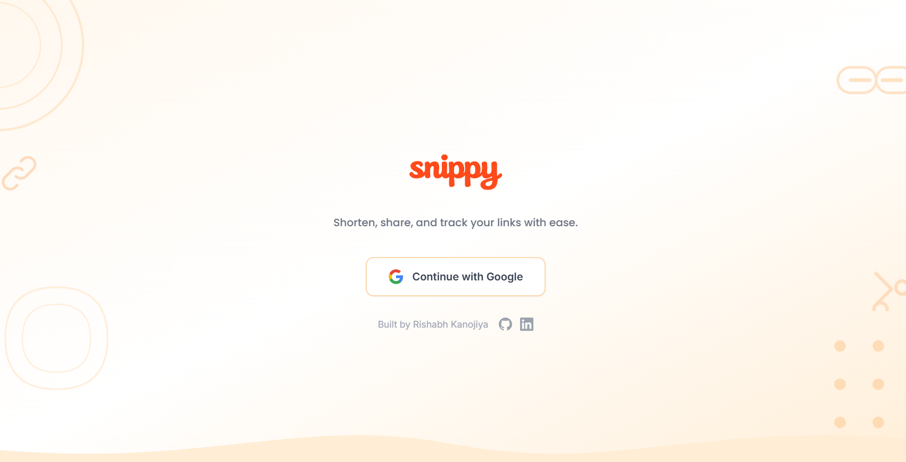

# Snippy ✂️

A minimal URL shortener with analytics.

Snippy lets you create short links, track clicks, and manage everything from a clean dashboard — no clutter, no noise.

## Preview

  

---

## Features

- Google OAuth authentication
- Short URL generation
- Custom aliases
- Link expiration
- Click analytics (Chart.js)
- QR code generation
- Copy-to-clipboard
- User-specific link library

---

## Tech Stack

**Frontend**
- React (Vite)
- JavaScript
- Tailwind CSS
- Chart.js

**Backend**
- Node.js
- Express
- MongoDB
- JWT
- Google OAuth 2.0

---
